# Teacher User Flow Chart: Shape of the Day

> A comprehensive guide to the teacher's experience in managing classrooms, creating content, and monitoring student progress in real-time.

---

## System Overview

The **Shape of the Day** application is a real-time classroom management tool that enables teachers to:
- Create and organize hierarchical learning content (Projects → Assignments → Tasks → Subtasks)
- Present daily lesson schedules to students via shareable join codes
- Monitor student progress and provide instant support during live sessions
- Collect anonymized analytics data for instructional improvement

### Key Architectural Principles
- **Session-Based Student Access**: Students use ephemeral sessions without persistent accounts
- **Privacy-First Data Model**: Student names (PII) are separated from analytics via a "Use & Destroy" policy
- **Real-Time Sync**: All interactions sync instantly via Firestore `onSnapshot` listeners
- **Zustand State Management**: Global state via `useClassStore` prevents prop-drilling

---

## 1. Authentication & Onboarding

### Entry Point
Teachers authenticate via **Google Sign-In** powered by Firebase Auth.

| Component | File | Purpose |
|-----------|------|---------|
| `AuthContext` | `src/context/AuthContext.tsx` | Manages auth state, login/logout |
| `App` | `src/App.tsx` | Routes authenticated users to TeacherDashboard |

### Authentication Flow


### Connections
- **Output → `TeacherDashboard.tsx`**: Successfully authenticated teachers land here
- **Data Store → `users` collection**: Stores `uid`, `email`, `displayName`, `settings`

### Edge Cases
| Scenario | Behavior |
|----------|----------|
| Network failure during login | Toast notification, retry prompt |
| Invalid/blocked account | Firebase Auth error, redirect to landing |
| Teacher logs out | Auth state cleared, redirect to landing page |

---

## 2. Teacher Dashboard (Central Hub)

### Overview
The `TeacherDashboard` is the central command center with a tabbed interface for accessing all teacher features.

| Component | File | Size |
|-----------|------|------|
| `TeacherDashboard` | `src/components/teacher/TeacherDashboard.tsx` | 35KB |

### Dashboard Tabs & Connections


### Global State Dependencies
| Store | Hook | Purpose |
|-------|------|---------|
| `useClassStore` | `src/store/classStore.ts` | Selected classroom context for all tabs |

### Connections
| From | To | Trigger |
|------|----|---------|
| Tab selection | Child component | Tab click renders component |
| `ClassroomManager` | All tabs | Selected classroom ID propagates via Zustand |
| Settings icon | `SettingsOverlay` | Opens modal overlay |
| Join Code icon | `JoinCodeOverlay` | Displays QR/code for active class |

---

## 3. Classroom Management

### Components Involved
| Component | File | Purpose |
|-----------|------|---------|
| `ClassroomManager` | `src/components/teacher/ClassroomManager.tsx` | List, select, manage classrooms |
| `ClassFormModal` | `src/components/teacher/ClassFormModal.tsx` | Create/edit classroom details |
| `ClassCard` | `src/components/teacher/ClassCard.tsx` | Individual classroom preview card |

### Classroom Management Flow


### Data Flow
| Collection | Fields | Access |
|------------|--------|--------|
| `classrooms` | `id`, `teacherId`, `name`, `code`, `isLive`, `settings` | Teacher: Read/Write |

### Connections
| From | To | Data Passed |
|------|----|-------------|
| `ClassroomManager` | `ClassFormModal` | Classroom data (edit mode) or empty (create) |
| `ClassroomManager` | `useClassStore` | `selectedClassroomId` (global) |
| `ClassCard` | `TaskInventory` | Quick view of class tasks |
| Classroom selection | All tabs | Selected classroom context |

### Edge Cases
| Scenario | Behavior |
|----------|----------|
| Delete classroom with active students | Warning modal, force disconnect students first |
| Edit classroom during live session | Updates propagate in real-time to students |
| No classrooms exist | Empty state with "Create First Classroom" CTA |

---

## 4. Content Creation (Task Manager)

### Components Involved
| Component | File | Size | Purpose |
|-----------|------|------|---------|
| `TaskManager` | `src/components/teacher/TaskManager.tsx` | 85KB | Main task creation interface |
| `RichTextEditor` | `src/components/shared/RichTextEditor.tsx` | — | Markdown-enabled description editor |
| `DatePicker` | `src/components/shared/DatePicker.tsx` | — | Start/end date selection |

### Content Hierarchy


### Task Creation Flow


### Auto-Save Behavior
| Event | Action |
|-------|--------|
| Idle for 2s with changes | Auto-save as draft, show "Draft" indicator |
| Manual "Save" click | Publish task, reset form |
| Navigate away with changes | Prompt to save or discard |

### Data Flow
| Collection | Fields | Notes |
|------------|--------|-------|
| `tasks` | `id`, `teacherId`, `title`, `description`, `type`, `parentId`, `classAssignments[]`, `startDate`, `endDate`, `resources[]` | Hierarchical via `parentId` |

### Connections
| From | To | Data/Action |
|------|----|-------------|
| `TaskManager` | Firestore `tasks` | CRUD operations |
| `TaskManager` | `useClassStore` | Get selected classroom for assignment |
| `TaskManager` | `ShapeOfDay` | Published tasks appear on schedule |
| `TaskManager` | `TaskInventory` | All tasks visible in library |
| Task card "Add Subtask" | `TaskManager` | Pre-sets `parentId` |
| Task summary card | `TaskManager` | Loads task for editing |

### Edge Cases
| Scenario | Behavior |
|----------|----------|
| Duplicate task with subtasks | Recursively duplicate entire tree |
| Edit task in use by live class | Changes reflect in real-time |
| Delete task with subtasks | Cascade delete confirmation |
| Reorder tasks | Update `order` field, re-number display |

---

## 5. Content Library (Task Inventory)

### Component
| Component | File | Size | Purpose |
|-----------|------|------|---------|
| `TaskInventory` | `src/components/teacher/TaskInventory.tsx` | 60KB | Searchable task library |

### Task Inventory Flow


### Features
| Feature | Description |
|---------|-------------|
| Hierarchical view | Collapsible tree showing Project → Assignment → Task → Subtask |
| Search | Filter by title, description content |
| Filter | By date range, assigned class, task type |
| Bulk actions | Multi-select for assign/delete |

### Connections
| From | To | Purpose |
|------|----|---------|
| `TaskInventory` | `TaskManager` | Edit existing task |
| `TaskInventory` | `ShapeOfDay` | Assign task to class schedule |
| Search/Filter | Firestore query | Dynamic filtering |

---

## 6. Daily Lesson Presentation (Shape of Day)

### Components
| Component | File | Size | Purpose |
|-----------|------|------|---------|
| `ShapeOfDay` | `src/components/teacher/ShapeOfDay.tsx` | 30KB | Day schedule view |
| `DatePicker` | (shared) | — | Select date to view/edit |
| `JoinCodeOverlay` | `src/components/teacher/JoinCodeOverlay.tsx` | 7KB | Display join code/QR |

### Shape of Day Flow


### Task Display
| Element | Description |
|---------|-------------|
| Task number | Day-relative numbering (1, 1.1, 1.2, 2, etc.) |
| Title | Task title with icon |
| Duration | Estimated time |
| Resources | Attachments, links |
| Status | Upcoming / Active / Completed |

### Join Code System


### Connections
| From | To | Purpose |
|------|----|---------|
| `ShapeOfDay` | `JoinCodeOverlay` | Display join mechanism |
| `ShapeOfDay` | `LiveView` | "Go Live" transitions to monitoring |
| `TaskManager` | `ShapeOfDay` | Published tasks appear here by date |
| Date selection | Firestore query | Filter tasks by `endDate` |

### Edge Cases
| Scenario | Behavior |
|----------|----------|
| No tasks for selected date | Empty state with "Add Tasks" prompt |
| Students join before "Go Live" | Held in waiting room |
| Regenerate join code | Invalidates old code, updates classroom.code |

---

## 7. Live Class Monitoring (Live View)

### Components
| Component | File | Size | Purpose |
|-----------|------|------|---------|
| `LiveView` | `src/components/teacher/LiveView.tsx` | 18KB | Real-time student monitoring |
| `ConnectionSidebar` | `src/components/teacher/ConnectionSidebar.tsx` | 10KB | Live student roster |

### Live View Flow

```mermaid
flowchart TD
    A[LiveView] --> B[Subscribe to live_students collection]
    B --> C[Real-time student list]
    
    C --> D{View Mode?}
    D -- "By Student" --> E[Grid of student cards]
    D -- "By Task" --> F[Task cards with student counts]
    
    E --> G[Each card shows: name, current task, status]
    F --> H[Each card shows: task name, student statuses]
    
    subgraph "Student Statuses"
        S1[🟢 Active - Working]
        S2[🟡 In Progress]
        S3[🔴 Stuck - Needs Help]
        S4[✅ Done]
        S5[⚪ Idle/Disconnected]
    end
    
    G --> I{Teacher Action?}
    I -- "Click Student" --> J[View detailed progress]
    I -- "Send Message" --> K[Push message to student]
    I -- "End Session" --> L[Trigger analytics scrub]
```


### Real-Time Data Flow


### Connections
| From | To | Purpose |
|------|----|---------|
| `LiveView` | `live_students` collection | Real-time sync |
| Student status change | `LiveView` | Instant UI update |
| `LiveView` | `ConnectionSidebar` | Roster also shows live students |
| "End Class" | `analyticsScrubber` | Trigger privacy cleanup |

### Edge Cases
| Scenario | Behavior |
|----------|----------|
| Student disconnects (tab close) | Status changes to "offline" after timeout |
| Multiple students with same name | Shown with unique session IDs |
| Network lag | Firebase handles reconnection, temporary desync |
| Student rejoins after disconnect | New session, old data already scrubbed |

---

## 8. Reports & Analytics

### Data Source
Analytics are derived from **anonymized session data** after live sessions end.

### Analytics Architecture


### Analytics Data Structure
```typescript
// analytics_logs document (NO NAMES)
{
  classroomId: string,
  date: "YYYY-MM-DD",
  sessionDuration: number,
  taskPerformance: [{
    taskId: string,
    title: string,
    timeToComplete_ms: number,
    statusWasStuck: boolean,
    questionsAsked: string[]
  }]
}
```

### Dashboard Views
| View | Purpose | Visualization |
|------|---------|---------------|
| Calendar | Browse past sessions by date | Calendar with session indicators |
| Time on Task | Actual vs. estimated duration | Bar chart |
| Friction Log | Anonymous questions asked | List of cards |
| Class Pulse | Success rate distribution | Pie chart |

### Connections
| From | To | Purpose |
|------|----|---------|
| `live_students` delete | `analytics_logs` create | Privacy scrubbing |
| `ClassroomManager` | Analytics views | "History" tab shows analytics |
| `analytics_logs` | Recharts components | Data visualization |

### Edge Cases
| Scenario | Behavior |
|----------|----------|
| No analytics for period | Empty state with explanation |
| Failed write | Retry with exponential backoff |
| Orphaned live_students docs | Cloud Function cleanup every 60min |

---

## 9. Settings & Overlays

### Components
| Component | File | Purpose |
|-----------|------|---------|
| `SettingsOverlay` | `src/components/teacher/SettingsOverlay.tsx` | Account & app preferences |
| `JoinCodeOverlay` | `src/components/teacher/JoinCodeOverlay.tsx` | Display/regenerate join codes |
| `ConnectionSidebar` | `src/components/teacher/ConnectionSidebar.tsx` | Live student roster sidebar |

### Settings Flow


### Connection Sidebar


---

## Complete User Flow Diagram


---

## Data Collections Summary

| Collection | Purpose | Access | Persistence |
|------------|---------|--------|-------------|
| `users` | Teacher accounts | Teacher: own data | Permanent |
| `classrooms` | Class configuration | Teacher: CRUD | Permanent |
| `tasks` | Content library | Teacher: CRUD | Permanent |
| `live_students` | Active session data | Teacher: Read, Student: Write own | Ephemeral |
| `analytics_logs` | Anonymized metrics | Teacher: Read | Permanent |

---

## Security Model


---

## Edge Cases & Recovery

| Category | Scenario | Resolution |
|----------|----------|------------|
| **Auth** | Session expires | Auto-refresh token or re-login prompt |
| **Network** | Connection lost | Firebase offline persistence, sync on reconnect |
| **Data** | Write conflict | Last-write-wins with server timestamp |
| **Privacy** | Tab close without sign-out | Cloud Function scrubs after 2hr inactivity |
| **UI** | State desync | Force refresh from Firestore |

---

## References

### Component Files
- [`TeacherDashboard.tsx`](file:///c:/Users/16047/Desktop/Antigravity/Shape%20of%20the%20Day%202/src/components/teacher/TeacherDashboard.tsx)
- [`ClassroomManager.tsx`](file:///c:/Users/16047/Desktop/Antigravity/Shape%20of%20the%20Day%202/src/components/teacher/ClassroomManager.tsx)
- [`TaskManager.tsx`](file:///c:/Users/16047/Desktop/Antigravity/Shape%20of%20the%20Day%202/src/components/teacher/TaskManager.tsx)
- [`TaskInventory.tsx`](file:///c:/Users/16047/Desktop/Antigravity/Shape%20of%20the%20Day%202/src/components/teacher/TaskInventory.tsx)
- [`ShapeOfDay.tsx`](file:///c:/Users/16047/Desktop/Antigravity/Shape%20of%20the%20Day%202/src/components/teacher/ShapeOfDay.tsx)
- [`LiveView.tsx`](file:///c:/Users/16047/Desktop/Antigravity/Shape%20of%20the%20Day%202/src/components/teacher/LiveView.tsx)
- [`ConnectionSidebar.tsx`](file:///c:/Users/16047/Desktop/Antigravity/Shape%20of%20the%20Day%202/src/components/teacher/ConnectionSidebar.tsx)
- [`SettingsOverlay.tsx`](file:///c:/Users/16047/Desktop/Antigravity/Shape%20of%20the%20Day%202/src/components/teacher/SettingsOverlay.tsx)
- [`JoinCodeOverlay.tsx`](file:///c:/Users/16047/Desktop/Antigravity/Shape%20of%20the%20Day%202/src/components/teacher/JoinCodeOverlay.tsx)

### Related Documentation
- [userjourney.md](file:///c:/Users/16047/Desktop/Antigravity/Shape%20of%20the%20Day%202/userjourney.md) - Narrative user journeys
- [DATA_STRUCTURE_PLAN.md](file:///c:/Users/16047/Desktop/Antigravity/Shape%20of%20the%20Day%202/DATA_STRUCTURE_PLAN.md) - Data models & security
- [teachercomponents.md](file:///c:/Users/16047/Desktop/Antigravity/Shape%20of%20the%20Day%202/teachercomponents.md) - Architecture blueprint

### Data Collections
- Firestore: `users`, `classrooms`, `tasks`, `live_students`, `analytics_logs`
- State: `useClassStore` (Zustand)
